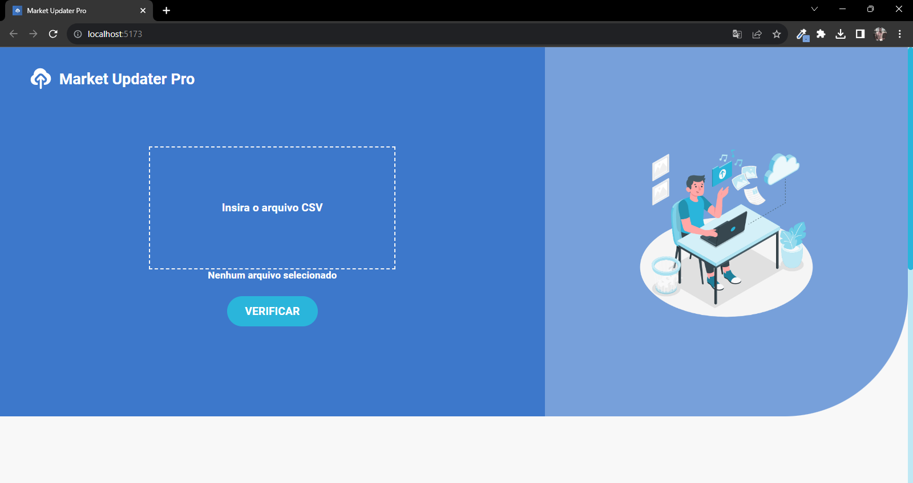
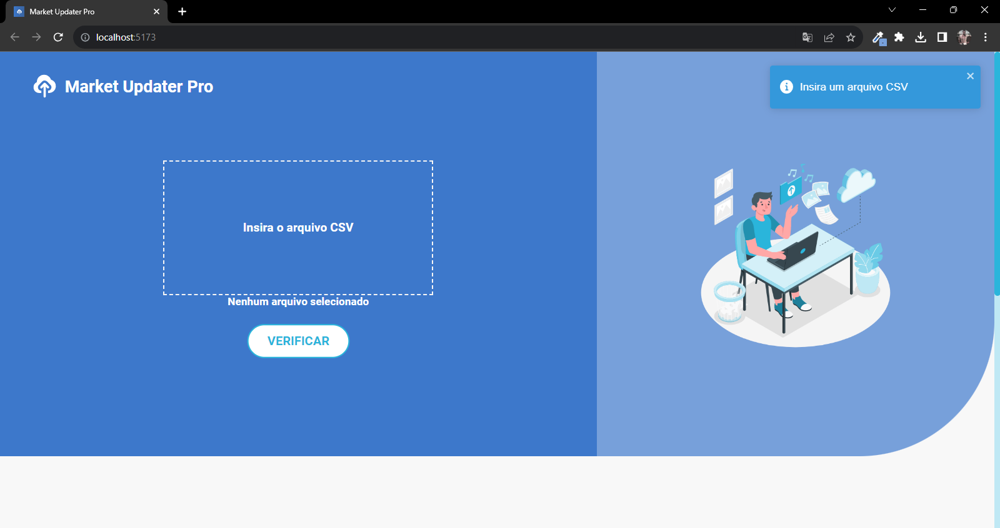
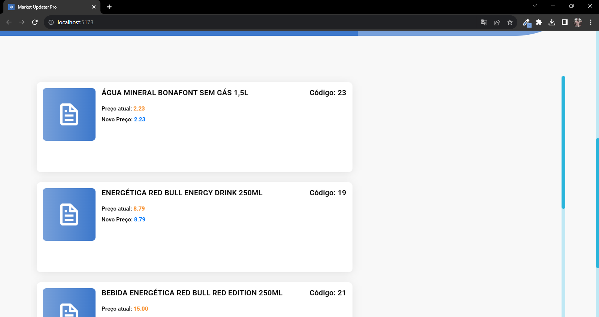
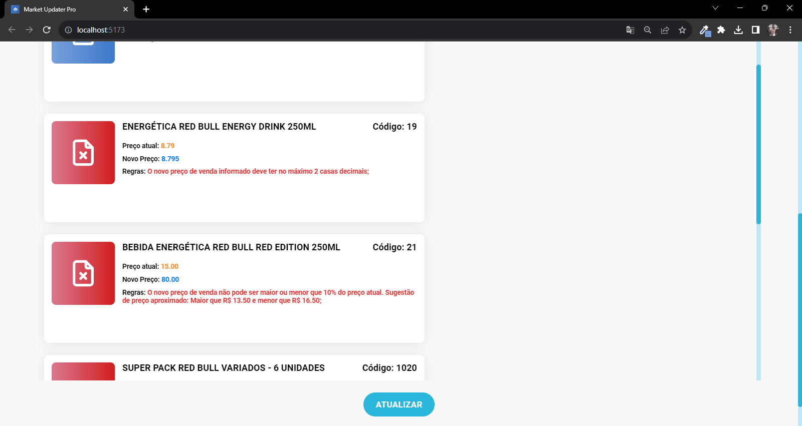
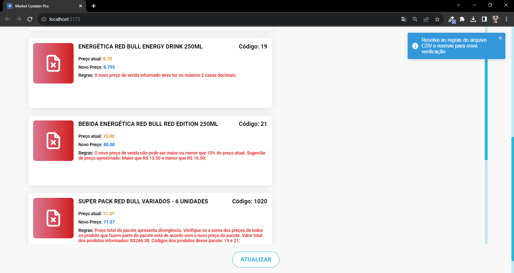
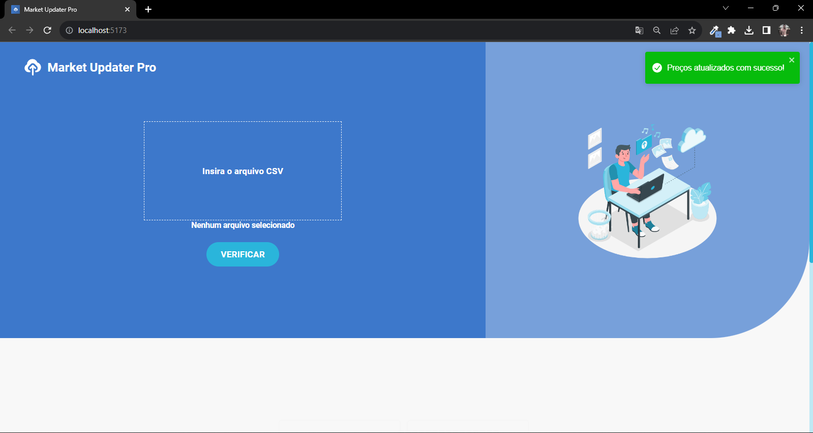
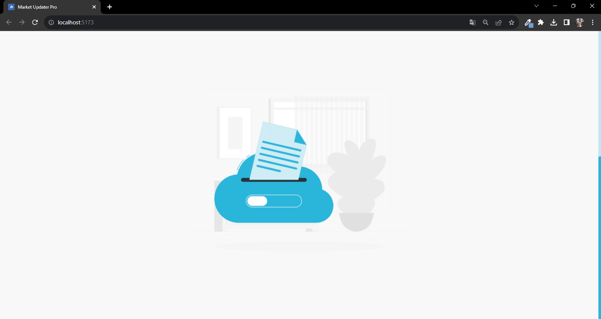

# E-Commerce Updater Pro (Market Updater Pro)

## Sobre o projeto:

Esse projeto faz parte de um desafio de Desenvolvimento Full Stack. Tal desafio consistia na criação de uma aplicação que auxilie empresas de e-commerce, trazendo mais rapidez e eficiência na hora de atualizarem os preços de seus produtos.

O projeto conta com uma API desenvolvida com Express.js e um layout produzido em React.js. 

Site do projeto: <a href="https://market-updater-pro.netlify.app/" target="_blank">Market Updater Pro</a> 

## Documentação da API:

A documentação da API e seus códigos podem ser acessados por meio desse link: <a href="https://github.com/LucasOliveria/Api-E-Commerce-Updater-Pro" target="_blank">https://github.com/LucasOliveria/Api-E-Commerce-Updater-Pro</a>

Na documentação estão todas as instruções para o seu uso.

## Como utilizar os códigos desse repositório:

Caso queira utilizar o código presente nesse repositório basta cloná-lo para sua máquina ou, se preferir, fazer fork e cloná-lo posteriormente. Após clonar, utilize o comando ```npm install``` no terminal do seu Editor de código para instalar node_modules e suas dependências. Após isso você poderá rodar a aplicação utilizando o comando ```npm run dev```.

## Linguagens e tecnologias utilizadas:

### Front-end:
* React.js
* JavaScript
* HTML
* CSS
* react-toastify
* Axios

### Back-end:
* TypeScript
* Express.js
* dotenv
* knex
* lodash
* multer
* mysql2
* csv-parser
* stream
* nodemon
* ts-node

## Layout:








## Autor
#### Lucas Oliveira

## Links
<a href="https://www.linkedin.com/in/lucas-oliveira-5b8a5532/" target="_blank">LinkedIn</a>

<a href="https://github.com/LucasOliveria/Api-E-Commerce-Updater-Pro" target="_blank">Repositório Back-end</a> 